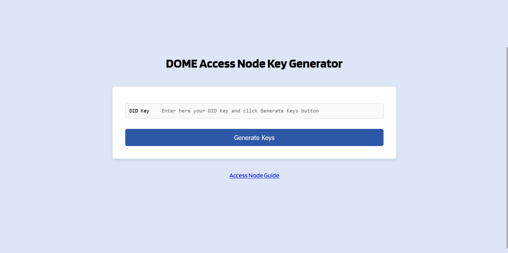
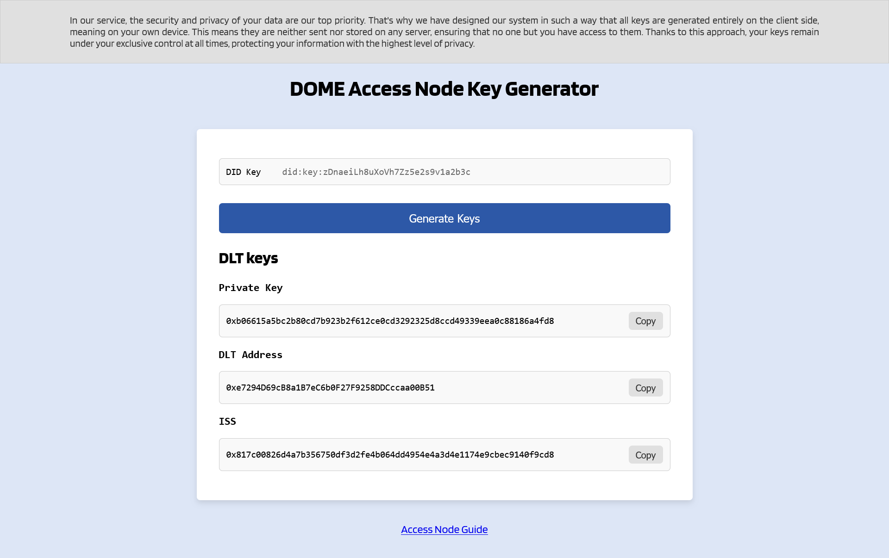

# Overview

Desmos is a data replication service designed for DOME Access Nodes. It synchronizes NGSI-LD entities between
distributed nodes, leveraging DLT for secure, auditable transactions. The service integrates with the Scorpio Context
Broker and exposes a REST API for replication management.

**Key Capabilities:**

- Data replication across DOME Access Nodes
- Integration with Scorpio Context Broker (NGSI-LD)
- Secure, verifiable transactions via DLT
- REST API for replication management

---

## Table of Contents

- [Overview](#overview)
    - [Table of Contents](#table-of-contents)
    - [Prerequisites](#prerequisites)
    - [Configuration Steps](#configuration-steps)
        - [Step 1: Obtain LEARCredentialMachine](#step-1-obtain-learcredentialmachine)
        - [Step 2: Generate DLT Keys](#step-2-generate-dlt-keys)
        - [Step 3: Register with DOME Trust Framework](#step-3-register-with-dome-trust-framework)
            - [3.1. Register as a Trusted Access Node](#31-register-as-a-trusted-access-node)
            - [3.2. Register as a Trusted Service](#32-register-as-a-trusted-service)
        - [Step 4: Configure Environment Variables](#step-4-configure-environment-variables)
            - [Required Configuration Variables](#required-configuration-variables)
            - [Environment Profile Mapping](#environment-profile-mapping)
            - [Environment Variables Configuration Examples](#environment-variables-configuration-examples)
        - [Step 5: Configure Secrets](#step-5-configure-secrets)
            - [Required Secret Variables](#required-secret-variables)
            - [Secrets Configuration Examples](#secrets-configuration-examples)
    - [Deployment](#deployment)
        - [Start All Services](#start-all-services)
        - [View Logs](#view-logs)
        - [Stop Services](#stop-services)
    - [Verification](#verification)
        - [1. Check Service Health](#1-check-service-health)
        - [2. Check Container Status](#2-check-container-status)
        - [3. Review Startup Logs](#3-review-startup-logs)
        - [4. Test via Caddy Proxy](#4-test-via-caddy-proxy)
    - [Troubleshooting](#troubleshooting)
        - [Database Connection Errors](#database-connection-errors)
        - [Invalid Credentials / Private Key Format](#invalid-credentials--private-key-format)
        - [DLT Adapter Connectivity Issues](#dlt-adapter-connectivity-issues)
        - [Missing Environment Variables](#missing-environment-variables)
        - [Port Conflicts](#port-conflicts)
    - [Related Documentation](#related-documentation)
    - [Support](#support)

---

## Prerequisites

Before configuring Desmos, ensure you have:

- ✅ **Docker & Docker Compose** installed and running
- ✅ **LEARCredentialMachine** issued by your Legal Entity Appointed Representative (LEAR) in your **DOME Wallet**
- ✅ **Public domain with valid TLS certificates** (HTTPS) for production deployments
- ✅ Basic understanding of **Docker Compose networking** and environment variables

---

## Configuration Steps

### Step 1: Obtain LEARCredentialMachine

Request a **LEARCredentialMachine** from your organization's Legal Entity Appointed Representative (LEAR). This
credential:

- Contains your organization's DID (Decentralized Identifier)
- Includes private key for authentication

---

### Step 2: Generate DLT Keys

Use the **DOME Access Node Key Generator** to generate your DLT address and other cryptographic keys.

1. Navigate to the DOME Access Node Key Generator
2. Enter your DID key from the LEARCredentialMachine
3. Generate and securely store the following:
    - **DLT Private Key**
    - **DLT Address**
    - **DLT ISS**

**Screenshots:**





> [!CAUTION]
> **CRITICAL: Secure Key Storage**
> Your private keys **cannot be recovered** if lost. Store them securely using:
>
> - Hardware security modules (HSM)
> - Secure password managers (e.g., 1Password, Bitwarden)
> - Dedicated secrets vaults (e.g., HashiCorp Vault, AWS Secrets Manager)
>
> **Never:**
>
> - Commit keys to version control
> - Share keys via email or chat
> - Store in plain text files on shared systems

---

### Step 3: Register with DOME Trust Framework

Register your organization and service with the DOME Trust Framework for your target environment.

#### 3.1. Register as a Trusted Access Node

Add your organization to the **Trusted Access Node List** following the DOME Trust Framework instructions.

| **Links**                                                                                               |
|---------------------------------------------------------------------------------------------------------|
| [SBX](https://github.com/DOME-Marketplace/trust-framework/blob/main/sbx/trusted_access_nodes_list.yaml) |
| [DEV](https://github.com/DOME-Marketplace/trust-framework/blob/main/dev/trusted_access_nodes_list.yaml) |
| [PRD](https://github.com/DOME-Marketplace/trust-framework/blob/main/prd/trusted_access_nodes_list.yaml) |

**YAML Template:**

```yaml
# Add to the Trusted Access Node List
- name: <organization_name>
  dlt_address: <dlt_address>
```

**Placeholder values:**

- `<organization_name>`: Your legal organization name
- `<dlt_address>`: DLT address from Step 2

**Example:**

```yaml
- name: "Acme Corporation"
  dlt_address: "0x1234567890abcdef1234567890abcdef12345678"
```

#### 3.2. Register as a Trusted Service

Add your Desmos service to the **Trusted Services List** following the DOME Trust Framework instructions.

| **Links**                                                                                           |
|-----------------------------------------------------------------------------------------------------|
| [SBX](https://github.com/DOME-Marketplace/trust-framework/blob/main/sbx/trusted_services_list.yaml) |
| [DEV](https://github.com/DOME-Marketplace/trust-framework/blob/main/dev/trusted_services_list.yaml) |
| [PRD](https://github.com/DOME-Marketplace/trust-framework/blob/main/prd/trusted_services_list.yaml) |

**YAML Template:**

```yaml
# Add to the Trusted Services List
- clientId: "<did:key>"
  redirectUris: [ ]
  scopes: [ ]
  clientAuthenticationMethods: [ "client_secret_jwt" ]
  authorizationGrantTypes: [ "client_credentials" ]
  postLogoutRedirectUris: [ ]
  requireAuthorizationConsent: false
  requireProofKey: false
  jwkSetUrl: "https://verifier.dome-marketplace-<env>.org/oidc/did/<did:key>"
  tokenEndpointAuthenticationSigningAlgorithm: "ES256"
```

> [!NOTE]
> Replace `<did:key>` with the DID key of your LEARCredentialMachine.
> Replace `<env>` with the environment.

---

### Step 4: Configure Environment Variables

Edit the `.env.desmos` file in the repository root to configure Desmos for your environment.

#### Required Configuration Variables

| Variable                           | Description                                        | Example Value                |
|------------------------------------|----------------------------------------------------|------------------------------|
| `SPRING_PROFILES_ACTIVE`           | Environment profile (see mapping below)            | `dev`                        |
| `OPERATOR_ORGANIZATION_IDENTIFIER` | Your organization's DID from LEARCredentialMachine | `did:key:zDnaei...`          |
| `API_EXTERNAL_DOMAIN`              | Public HTTPS URL for your Desmos API               | `https://desmos.example.org` |

#### Environment Profile Mapping

Choose the correct Spring profile for your target DOME environment:

| Desmos Profile (`SPRING_PROFILES_ACTIVE`) | DOME Environment(GitOps) | Description                                 |
|:-----------------------------------------:|:------------------------:|---------------------------------------------|
|                   `dev`                   |    **sbx** (Sandbox)     | Development/integration testing environment |
|                  `test`                   |  **dev** (Development)   | QA environment                              |
|                  `prod`                   |   **prd** (Production)   | Production environment                      |

#### Environment Variables Configuration Examples

**Sandbox (Development):**

```properties
# Spring profile for sandbox environment
SPRING_PROFILES_ACTIVE=dev
# Organization DID from LEARCredentialMachine
OPERATOR_ORGANIZATION_IDENTIFIER=did:key:zDnaeiLh8uXoVh7Zz5e2s9v1a2b3c
# Public domain (use localhost for local testing)
API_EXTERNAL_DOMAIN=https://desmos-sandbox.example.org
```

**Production:**

```properties
# Spring profile for production environment
SPRING_PROFILES_ACTIVE=prod
# Organization DID from LEARCredentialMachine
OPERATOR_ORGANIZATION_IDENTIFIER=did:key:zDnaeiLh8uXoVh7Zz5e2s9v1a2b3c
# Public domain with valid TLS certificates
API_EXTERNAL_DOMAIN=https://desmos.example.org
```

> **Database and broker configurations** are pre-configured in `.env.desmos` for the Docker Compose environment. Review
> these settings if you need custom configurations.

---

### Step 5: Configure Secrets

Add secrets to provide sensitive credentials.

#### Required Secret Variables

| Variable                                     | Description                           | Source                    |
|----------------------------------------------|---------------------------------------|---------------------------|
| `SECURITY_PRIVATE_KEY`                       | Private key for cryptographic signing | Generated in Step 2       |
| `SECURITY_LEAR_CREDENTIAL_MACHINE_IN_BASE64` | Base64-encoded LEARCredentialMachine  | From your wallet (Step 1) |

#### Secrets Configuration Examples

**Private Key:**

```properties
# Private key from DOME Key Generator (Step 2)
SECURITY_PRIVATE_KEY=0xabc123def456789...
```

**LEARCredentialMachine (Base64):**

```bash
# Encode your LEARCredentialMachine to base64
$ cat lear-credential.txt | base64 -w 0
```

```properties
# Paste the base64-encoded credential
SECURITY_LEAR_CREDENTIAL_MACHINE_IN_BASE64=ZXlKaGJHY2lPaUpJVXpJMU5pSXNJbXRwWkNJNkltRjFZV3h6SWpwN0ltbGtJam9pYkd4aGJtNWxJam9pT0RZME5Ea3hOakV3TWpBeE1...
```

---

## Deployment

Once configuration is complete, deploy the Desmos service using Docker Compose.

### Start All Services

```bash
# Start all Access Node services (including Desmos)
docker compose up -d
```

### View Logs

```bash
# Follow Desmos logs
docker compose logs -f desmos
```

### Stop Services

```bash
# Stop all services
docker compose down

# Stop services and remove volumes (CAUTION: deletes database)
docker compose down -v
```

---

## Verification

Verify that Desmos is running correctly:

### 1. Check Service Health

```bash
# Health check endpoint
curl http://localhost:8080/health

# Expected response:
# {"status":"UP"}
```

### 2. Check Container Status

```bash
# Verify container is running
docker compose ps desmos

# Expected output:
# NAME      IMAGE                                COMMAND     SERVICE   CREATED   STATUS      PORTS
# desmos    in2workspace/in2-desmos-api:v2.0.3  ...         desmos    ...       Up 2 min    8080/tcp
```

### 3. Review Startup Logs

> [!TIP]
> **Successful startup logs should include:**
>
> - ✅ Started DesmosApplication in X.XXX seconds
> - ✅ Netty started on port 8080
> - ✅ Database migration completed successfully
> - ✅ Connected to Context Broker (Scorpio)
> - ✅ Connected to DLT Adapter

### 4. Test via Caddy Proxy

If Caddy is running, test the external endpoint:

```bash
# Via Caddy reverse proxy
curl http://localhost/desmos/health
```

---

## Troubleshooting

### Database Connection Errors

**Symptom:**

> Error: Connection refused - postgis:5432

**Solutions:**

1. Ensure PostgreSQL is running: `docker compose ps postgis`
2. Check database initialization: `docker compose logs postgis`
3. Confirm the network connectivity: `docker compose exec desmos ping postgis`

---

### Invalid Credentials / Private Key Format

**Symptom:**

> Error: Invalid private key format
> Error: Failed to decode LEAR credential

**Solutions:**

1. **Private key**: Must start with `0x` and be a valid hexadecimal string

   ```bash
   # Valid format example:
   SECURITY_PRIVATE_KEY=0x1234567890abcdef...
   ```

2. **Base64 credential**: Ensure no line breaks or whitespace

   ```bash
   # Encode without line wrapping:
   cat lear-credential.json | base64 -w 0
   ```

3. **Verify credentials** are from the correct environment (sandbox vs production)

---

### DLT Adapter Connectivity Issues

**Symptom:**

> Error: Connection timeout - dlt-adapter-alastria:8080
> Error: DLT transaction failed

**Solutions:**

1. Verify DLT Adapter is running: `docker compose ps dlt-adapter-alastria`
2. Check DLT Adapter logs: `docker compose logs dlt-adapter-alastria`
3. Confirm network connectivity: `docker compose exec desmos curl http://dlt-adapter-alastria:8080/health`
4. Verify your DLT address is registered in the Trusted Access Node List

---

### Missing Environment Variables

**Symptom:**

> Error: Required property 'OPERATOR_ORGANIZATION_IDENTIFIER' is not set

**Solutions:**

1. Verify `.env.desmos` exists and is properly formatted
2. Check for typos in variable names
3. Ensure no trailing spaces or quotes around values
4. Confirm `.secrets.desmos` is loaded (see Step 5 note about `env_file`)
5. Restart the container after configuration changes: `docker compose restart desmos`

---

### Port Conflicts

**Symptom:**

> Error: Bind for 0.0.0.0:8080 failed: port is already allocated

**Solutions:**

1. Stop conflicting services or change Desmos port in `compose.yaml`
2. Use the Caddy proxy instead of exposing Desmos directly
3. Check for other services using port 8080: `netstat -tulpn | grep 8080`

---

## Related Documentation

- **[Main README](README.md)** — Access Node Docker Compose architecture and service catalog
- **[DOME Trust Framework](https://github.com/DOME-Marketplace/trust-framework)** — Registration and trust model
  documentation
- **[Scorpio Context Broker](https://scorpio.readthedocs.io/)** — NGSI-LD entity management
- **[compose.yaml](compose.yaml)** — Full service definitions and configuration
- **[Caddyfile](Caddyfile)** — Reverse proxy routing configuration

---

## Support

For issues or questions:

1. **Check logs**: `docker compose logs desmos`
2. **Review configuration**: Verify all environment variables and secrets
3. **Consult DOME Trust Framework**: Ensure proper registration
4. **GitHub Issues**: Report bugs or request features at the project repository

---

**Last Updated:** March 5, 2026  
**Desmos Version:** v2.0.3  
**Docker Compose Version:** Compatible with Docker Compose v2.x
